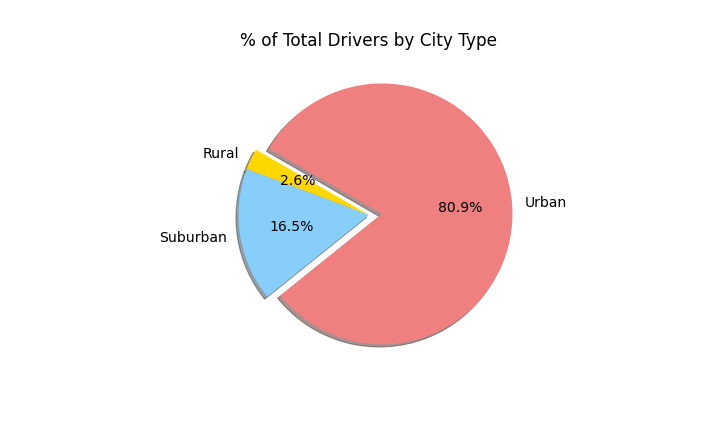

# PyBer_Analysis
## Overview of the Analysis:
### Purpose:
- The purpose of this analysis was to see how the PyBer Ride Sharing app was used and how it performed per type of city (Urban, Suburban, and Rural). To see how each city type was performing, we analyzed how the price of fares, number of rides given, and number of drivers available per each city type affected the data. 

## Results:
### Percent of Total Fares by City Type
- The following is a pie chart showing the percentage of total fares by city type. As we can see, the light coral portion of the pie chart represents Urban cities, the light blue portion of the pie chart represents Suburban cities, and the yellow portion of the pie chart represents Rural cities. Urban cities contribute the largest portion of the total fare amount by over half of the total contributions, while Suburban cities contribute the next largest portion around 30% of the total fare amount, and Rural cities contribute the least by quite a bit, only contributing to about about 7% of the total fares. 

### Percent of Total Rides by City Type
- The following is a pie chart showing the percentage of total rides by city type. Again the light coral represents Urban cities, the light blue represents Suburban cities, and the yellow represents Rural cities. Again, we can see that Urban cities tend to use the app the most with almost 70% of the total contribution of users/riders, Suburban follows behind with about 26% of the contribution, while Rural falls far behind with only contributing about 5% of the total users/riders.

### Percent of Total Drivers by City Type

-The following is a pie chart showing the percentage of total drivers by city type. As is the case with the other two pie charts, light coral represents Urban city drivers, light blue represents Suburban city drivers, and yellow represents Rural city drivers. Following the same pattern as above, Urban cities offer more drivers, Suburban cities offer the next amount of drivers, and Rural cities offer the least amount of drivers. Urban cities show an overwhelming amount of drivers available with almost 81% of the total drivers, while Suburban cities only offer about 17% of the total drivers, and Rural cities have by far the least amount of drivers available with only around 3% of the total drivers.

### PyBer Fare Summary between January and April

- Last, we have a line graph depicting the total fare by city type between January 1, 2019 to April 28,2019.
Following the trend we saw with the pie charts, Urban cities contribute the highest total fare amounts between $1,500 and $2,500, Suburban cities contribute the next highest total fare amounts between $500 and $1,500, and Rural cities offer the least total fare amounts all being $500 or less. 

## Summary
### Recommendations addressing disparities among the city types.
- As we can see, Urban cities greatly overcast either Suburban or Rural cities even when they are combined. In order to try to even out the large disparity, I recommend the follow items be addressed.
    - Increase the number of drivers available for Suburban and Rural cities
    - Offer more advertising in Suburban and Rural cities to help try to increase the number of users/riders in both of those city types
    - Offer better or more competitive fare prices for Suburban and Rural cities so they can compete more equally with Urban cities. 